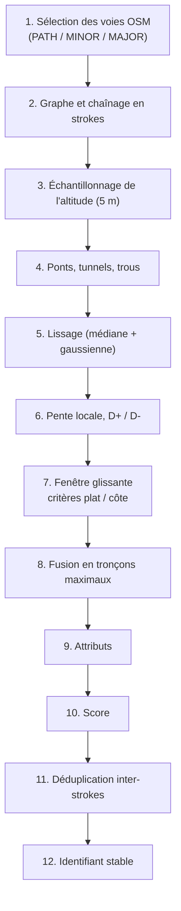

# Algorithme de détection

Ce document décrit, étape par étape, comment le pipeline passe d'un extrait
OpenStreetMap et d'un MNT à une liste de **segments plats** et de **côtes**.
Les noms de paramètres entre crochets (`[profile.step_m]`) sont ceux de
`src/flat_segments/params.py`. La [table récapitulative](#13-récapitulatif-des-paramètres)
est en fin de document.

Conventions :

- Coordonnées en **Lambert-93 (EPSG:2154)**, distances en mètres.
- Pentes en **pourcentage** (`100 × Δz / Δd`).
- Un *stroke* est une polyligne continue du réseau. Un *segment* est une
  portion de stroke retenue comme plat ou comme côte.

---

## 1. Sélection et classement des voies

Chaque way OSM portant un tag `highway` est rangée dans une classe
(`osm.classify_way`) :

| Classe | Valeurs `highway` | Rôle |
|---|---|---|
| `MAJOR` | `motorway`, `trunk`, `primary`, `secondary`, `tertiary` et leurs `_link` | **Barrière** : jamais support d'un segment ; un stroke est coupé à tout nœud partagé avec elle |
| `MINOR` | `residential`, `unclassified`, `living_street`, `service`, `road` | Support possible ; toute intersection avec elle compte comme une **traversée** |
| `PATH` | `footway`, `path`, `cycleway`, `track`, `pedestrian`, `bridleway` | Support ; les intersections entre `PATH` sont de simples **carrefours** |
| *(exclue)* | `steps`, `construction`, `proposed`, `platform`, `corridor`, `elevator`, `raceway`, `bus_guideway`, `busway`, `escape`, `via_ferrata`, `abandoned`, `razed`, `rest_area`, `services` | Ignorée |

Une voie `MINOR` ou `PATH` est aussi **exclue** si l'une de ces conditions est
vraie (on doit pouvoir y courir en aller-retour) :

- `area=yes` (zone piétonne dessinée en polygone) ;
- `service` ∈ {`parking_aisle`, `driveway`, `drive-through`, `emergency_access`} ;
- `foot` ∈ {`no`, `private`, `use_sidepath`} ;
- `access` ∈ {`private`, `no`, `agricultural`, `forestry`, `delivery`, `military`},
  sauf si `foot` ∈ {`yes`, `designated`, `permissive`} ;
- `oneway:foot=yes`.

Les voies `MAJOR` sont conservées quels que soient leurs tags d'accès : même
privée, une route importante reste une barrière.

Tags extraits pour chaque way retenue : `highway`, `surface`, `tracktype`,
`lit`, `bridge`, `tunnel`, `covered`, `layer`, `name`.

## 2. Construction du graphe et chaînage en *strokes*

**Problème.** Couper le réseau à chaque intersection produit des arêtes très
courtes : une voie verte croisée tous les 150 m par un sentier ne contiendrait
jamais de segment de 400 m. **Solution** : chaîner les arêtes par *continuité
naturelle* (*strokes*, principe de « bonne continuité »), et garder les
carrefours comme des **événements** le long du stroke.
Voir [ADR 0006](adr/0006-strokes-et-troncons-maximaux.md).

Étapes (`network.build_strokes`) :

1. **Nœuds barrières** : l'ensemble des nœuds appartenant à au moins une voie
   `MAJOR`.
2. **Découpage en arêtes.** Les voies support (`MINOR` + `PATH`) sont découpées
   à chaque nœud qui est partagé par au moins deux voies support, qui est un
   nœud barrière ou qui apparaît deux fois dans la même voie (boucle).
3. **Degré** d'un nœud = nombre d'extrémités d'arêtes qui y aboutissent.
4. **Appariement des arêtes à chaque nœud** :
   - nœud barrière : aucun appariement, **le stroke s'arrête** ;
   - degré 1 (cul-de-sac) : aucun appariement ;
   - degré 2 : les deux arêtes sont appariées, même en virage serré (la
     sinuosité s'en charge plus loin) ;
   - degré ≥ 3 : pour chaque paire d'arêtes, on calcule la **déflexion**, c'est-à-dire
     l'écart à la ligne droite. Chaque arête a un cap de sortie, mesuré du nœud
     vers le point situé à `[network.bearing_probe_m]` = 15 m sur l'arête (ou
     vers son extrémité si elle est plus courte). Pour deux caps `a` et `b`, la
     déflexion vaut `180° − angle(a, b)` : elle est nulle quand les deux arêtes
     sont exactement dans le prolongement l'une de l'autre. Les paires sont
     triées par déflexion croissante et appariées gloutonnement tant que la
     déflexion est ≤ `[network.max_deflection_deg]` = 35° et que les deux
     arêtes sont libres.
5. **Parcours.** Partant de chaque arête non visitée, on suit les appariements
   dans les deux sens et on concatène les géométries. Un cycle fermé donne un
   stroke en anneau, parcouru une seule fois.
6. **Annotations** du stroke :
   - `parts` : pour chaque way traversée, l'intervalle `[start_m, end_m]` le
     long du stroke et ses attributs (`highway`, `surface`, `tracktype`, `lit`,
     `structure` ∈ {`bridge`, `tunnel`, ∅}) ;
   - `events` : à chaque nœud intérieur de degré ≥ 3, un événement à la
     distance `offset_m`, de type
     - `crossing` si une autre arête incidente (hors du stroke) est `MINOR` :
       intersection avec une route circulée,
     - `junction` sinon : carrefour de chemins.

Un stroke peut changer de classe en cours de route, par exemple une voie verte
qui se prolonge en rue résidentielle. Il ne franchit jamais une route `MAJOR`.

## 3. Échantillonnage de l'altitude

(`geometry.resample`, `elevation.sample_stroke`)

1. Le stroke, de longueur `L`, est rééchantillonné en `n = ceil(L / step)`
   intervalles égaux, avec `[profile.step_m]` = 5 m. Le pas effectif `L / n`
   est donc ≤ 5 m, et l'étape `detect` retrouve exactement la même grille.
2. L'altitude est lue dans le MNT par **interpolation bilinéaire** : le
   MNT est au pas de 2 m (LiDAR HD, [ADR 0007](adr/0007-altitude-lidar-hd.md)), et
   l'interpolation évite les marches d'escalier.
3. *(option)* **Échantillonnage transversal** : si
   `[profile.lateral_offset_m]` > 0, on échantillonne aussi à ± cette
   distance, perpendiculairement au tracé, et on garde la médiane des trois
   valeurs. Cela limite l'effet d'une géométrie OSM décalée sur un talus. Désactivé
   par défaut (0 m), à évaluer en phase 1.
4. Les valeurs *nodata* du MNT deviennent `NaN`.
5. **Repli sur le RGE ALTI** (production par département, depuis le
   03/10/2026, [ADR 0007](adr/0007-altitude-lidar-hd.md)). Là où le LiDAR HD
   n'est pas encore publié, un stroke peut garder des trous que l'étape 4 ne
   comble pas : hors des ponts et tunnels, et plus longs que
   `[profile.max_gap_fill_m]`.
   - Le stroke est alors relu dans le RGE ALTI (WMS, `rge_alti_wms`).
   - Ce second profil remplace le premier, **en entier**, s'il laisse moins
     de tels trous.
   - Chaque segment n'a donc qu'une source, celle de son stroke.
   - Un trou comblé, sous un pont par exemple, ne déclenche pas le repli.

Sortie : `z_raw`, un tableau aligné sur la grille, stocké dans
`profiles.parquet`. Les étapes suivantes (4 à 6) sont recalculées à chaque
`detect`.

## 4. Ponts, tunnels et trous

(`profile.build_profile`)

1. **Ouvrages d'art.** Pour chaque tronçon du stroke portant
   `structure = bridge` (tag `bridge` ≠ `no`) ou `structure = tunnel` (tag
   `tunnel` ≠ `no`, ou `covered=yes`), les échantillons compris dans
   `[start_m − marge, end_m + marge]`, avec `[profile.structure_margin_m]` = 5 m,
   sont remplacés par une **interpolation linéaire** entre les échantillons
   valides qui l'encadrent. La longueur de l'ouvrage n'importe pas. Si l'ouvrage
   touche l'extrémité du stroke, les échantillons restent `NaN`.
2. **Trous du MNT.** Les suites de `NaN` d'une longueur ≤
   `[profile.max_gap_fill_m]` = 20 m, encadrées par des valeurs valides, sont
   interpolées linéairement. Les trous plus longs restent `NaN`.
3. Les échantillons interpolés sont marqués. Les segments qui les contiennent
   reçoivent un *flag* de qualité : `bridge_interpolated`,
   `tunnel_interpolated` ou `gap_filled`.

## 5. Lissage

Le MNT et la géométrie OSM sont bruités (végétation résiduelle, décalage de
quelques mètres). On lisse en deux temps :

1. **Médiane glissante** sur `[profile.median_window_m]` = 15 m (3
   échantillons, nombre impair) : supprime les pics isolés sans émousser les
   ruptures de pente.
2. **Gaussienne** d'écart-type `[profile.gaussian_sigma_m]` = 10 m (noyau
   tronqué à ±3σ).

Détails d'implémentation :

- **Bords** : le signal est prolongé par réflexion **impaire** (symétrie
  centrale autour de l'extrémité : `z(−k) = 2·z(0) − z(k)`). Un profil
  linéaire est ainsi conservé exactement jusqu'aux extrémités, sans biais de
  pente aux bords.
- **`NaN`** : ils ont un poids nul ; le noyau est renormalisé sur les
  échantillons valides, et un échantillon `NaN` reste `NaN`.

## 6. Pente locale, D+ et D-

(`profile.local_grade_pct`, `profile.elevation_gain_loss`)

- **Pente locale** au point `i` : différence centrée sur une base de
  `[profile.grade_base_m]` = 20 m :
  `g[i] = 100 × (z[i+h] − z[i−h]) / (d[i+h] − d[i−h])`, avec `h = round(base / 2 / pas)`.
  Aux bords, les indices sont bornés et la différence devient décentrée. Une
  base de 20 m sur un profil lissé filtre le bruit résiduel tout en détectant
  une rampe de quelques dizaines de mètres.
- **D+ / D-** : cumul des montées et des descentes du profil lissé, avec une
  hystérésis de `[profile.gain_hysteresis_m]` = 0,5 m. Une variation n'est
  comptée que lorsqu'elle dépasse 0,5 m depuis le dernier point de référence ;
  le reliquat final est ajouté. On garantit ainsi que `D+ − D- = z_fin − z_début`.

## 7. Fenêtre glissante

Une fenêtre de longueur `W` couvre `n = round(W / pas)` intervalles. Elle
avance de `[detection.window_step_m]` = 10 m. Pour chaque position
`[i, i+n]`, on calcule :

| Grandeur | Définition |
|---|---|
| pente moyenne | `100 × (z[i+n] − z[i]) / (d[i+n] − d[i])` |
| pente locale max | `max |g[i..i+n]|` |
| sinuosité | `(d[i+n] − d[i]) / ‖xy[i+n] − xy[i]‖` (longueur / distance à vol d'oiseau, ≥ 1) |
| validité | aucun `NaN` dans `z[i..i+n]` |

### 7.1 Critères « plat »

Longueur de fenêtre : `W₀ = min([flat.target_lengths_m])` = 200 m.
Une fenêtre est valide si :

- `|pente moyenne| ≤ [flat.max_mean_grade_pct]` = 1 %
- `pente locale max ≤ [flat.max_local_grade_pct]` = 2 %
- `sinuosité ≤ [flat.max_sinuosity]` = 1,2

### 7.2 Critères « côte »

Longueur de fenêtre : `W₀ = min([climb.target_lengths_m])` = 100 m.
On traite les deux sens de parcours : `s = +1` (sens du stroke) et `s = −1`.
Une fenêtre est valide pour le sens `s` si :

- `[climb.min_mean_grade_pct]` = 3 % ≤ `s × pente moyenne` ≤ `[climb.max_mean_grade_pct]` = 15 %
- **pas de replat** : le plus long tronçon continu de la fenêtre où
  `s × g < [climb.min_local_grade_pct]` (1 %) mesure au plus
  `[climb.max_flat_stretch_m]` = 20 m
- `sinuosité ≤ [climb.max_sinuosity]` = 1,5 (lacets tolérés)

Le replat est mesuré sur la pente **lissée** `g`. Le lissage et la base de
20 m le raccourcissent d'environ 25 m par rapport au terrain : un replat réel
de 40 m est toléré, un replat de 60 m coupe la côte (vérifié par les tests).

Les traversées ne rendent pas une fenêtre invalide. Elles sont comptées,
pénalisées dans le score (§ 10), et le front peut exiger « 0 traversée ».

## 8. Fusion en tronçons maximaux

Plutôt que de produire une fenêtre de longueur fixe par longueur cible, on
fusionne les fenêtres valides qui se chevauchent ou se touchent (union
d'intervalles, `detect.merge_intervals`). Chaque union forme un **tronçon
maximal**. Pour les côtes, on ne fusionne que des fenêtres de même sens.
Voir [ADR 0006](adr/0006-strokes-et-troncons-maximaux.md).

- **Plat** : un tronçon maximal est une union de fenêtres valides. Sa pente
  moyenne globale n'est pas bornée par 1 %, mais elle reste ≤ à la pente
  locale max (2 %). Les statistiques réelles sont calculées et publiées, et
  le front filtre dessus.
- **Côte** : deux unions de fenêtres valides peuvent se rejoindre au milieu
  d'un replat. On **coupe** donc le tronçon fusionné autour de tout replat
  (`s × g < min_local_grade`) plus long que `max_flat_stretch_m`. Puis on
  **rogne** les extrémités tant que `s × g < min_local_grade` (retire les
  amorces et fins de pente molles). Si le tronçon rogné mesure
  moins de `W₀`, il est abandonné. Le segment est orienté **vers le haut** :
  si `s = −1`, géométrie et profil sont inversés, et la pente moyenne publiée
  est positive.
- **`fits_targets_m`** : pour chaque longueur cible `T`, on vérifie qu'au moins
  une fenêtre de longueur `T` incluse dans le tronçon (pas d'un échantillon)
  respecte les critères du § 7. Un plat de 1,3 km dont la pente moyenne
  dépasse 1 % sur tout kilomètre aura ainsi `fits_targets_m = [200, 400]`.

La géométrie publiée est la **sous-polyligne exacte** du stroke entre les
deux abscisses (sommets OSM d'origine), et non la version rééchantillonnée.

Il n'y a **pas de longueur maximale** : un tronçon long reste utilisable pour
des répétitions plus courtes, et le filtre du front porte sur la longueur
minimale souhaitée.

## 9. Attributs d'un segment

Les définitions complètes sont dans [`data-model.md`](data-model.md). Calcul
sur l'intervalle `[a, b]` du stroke :

- **Longueur, altitudes, D+/D-, pentes** : à partir du profil lissé ; la pente
  locale max est `max |g|` sur l'intervalle.
- **Sinuosité** : longueur / distance entre extrémités, sur la géométrie exacte.
- **Traversées / carrefours** : événements `crossing` / `junction` dont
  l'abscisse est strictement comprise dans `]a, b[`. Un segment qui commence
  sur un carrefour ne le compte pas.
- **Revêtement** : catégorie majoritaire en longueur parmi les `parts`
  (`osm.surface_category`) :

  | Catégorie | Valeurs OSM `surface` |
  |---|---|
  | `paved` | `asphalt`, `paved`, `concrete`, `concrete:plates`, `concrete:lanes`, `paving_stones`, `chipseal`, `tartan`, `rubber`, `acrylic` |
  | `compacted` | `compacted`, `fine_gravel` |
  | `gravel` | `gravel`, `pebblestone` |
  | `cobbles` | `sett`, `cobblestone`, `unhewn_cobblestone` |
  | `unpaved` | `unpaved`, `ground`, `dirt`, `earth`, `grass`, `mud`, `sand`, `soil`, `woodchips`, `grass_paver` |
  | `unknown` | absent ou autre valeur |

  Sans tag `surface`, on déduit : `tracktype=grade1` → `compacted`,
  `grade2` → `gravel`, `grade3`–`grade5` → `unpaved`, et une voie `MINOR` →
  `paved` (convention courante en France pour les rues).
- **Éclairage** (`lit`) : `yes`-like = {`yes`, `24/7`, `automatic`,
  `sunset-sunrise`, `limited`, `interval`}, `no`-like = {`no`, `disused`}.
  Valeur publiée : `yes` si ≥ 90 % de la longueur est éclairée ; sinon
  `partial` si une partie l'est ; sinon `no` si ≥ 50 % est `no` ; sinon
  `unknown`.
- **Nom** : valeur `name` majoritaire en longueur, si elle couvre au moins la
  moitié du segment ; sinon aucun nom.
- **Ouvrages, flags** : `on_structure` si un tronçon `bridge`/`tunnel` touche
  l'intervalle ; `quality_flags` selon le § 4.

## 10. Score

Score entre 0 et 100 : moyenne pondérée de composantes normalisées dans
[0, 1] (`detect.score_flat`, `detect.score_climb`).

| Composante | Définition | Poids plat | Poids côte |
|---|---|---|---|
| planéité | `1 − ½·|pente moy.|/max_mean − ½·pente locale max/max_local` | 0,35 | — |
| régularité | `1 − σ(s·g) / pente moyenne` (σ : écart-type de la pente locale) | — | 0,35 |
| traversées | `1 / (1 + traversées par km)` | 0,25 | 0,30 |
| rectitude | `1 − (sinuosité − 1) / (max_sinuosity − 1)` | 0,20 | 0,10 |
| revêtement | `paved` 1 · `compacted` 0,8 · `gravel` 0,6 · `unknown` 0,5 · `cobbles` 0,4 · `unpaved` 0,4 | 0,10 | 0,15 |
| éclairage | `yes` 1 · `partial` 0,5 · `unknown` 0,3 · `no` 0 | 0,05 | 0,05 |
| longueur | part des longueurs cibles atteintes (`fits_targets_m`) | 0,05 | 0,05 |

Chaque composante est bornée à [0, 1]. Les poids sont réglables
(`[flat.weights]`, `[climb.weights]`).

La **distance à l'utilisateur** n'entre pas dans le score précalculé : elle
dépend de la position, donc du navigateur. Le front trie par distance ou par
score, et pour les côtes peut classer par écart à la pente cible choisie.

## 11. Déduplication inter-strokes

Au sein d'un stroke, la fusion (§ 8) supprime déjà les chevauchements. Entre
strokes différents, il reste des doublons : un trottoir `footway=sidewalk` et
sa rue, deux chaussées parallèles, une piste cyclable le long d'un chemin.

Algorithme (`detect.deduplicate`), pour chaque type (`flat`, `climb`)
séparément :

1. Trier les segments par score décroissant.
2. Pour chaque candidat A, pris dans cet ordre : A est **écarté** s'il existe
   un segment K déjà retenu tel que la part des points de A (rééchantillonnés
   tous les `[profile.step_m]`) situés à moins de `[dedup.buffer_m]` = 20 m
   de K dépasse `[dedup.max_overlap]` = 50 %. Sinon, A est retenu.
3. Pré-filtre : on ne compare que les paires dont les boîtes englobantes,
   élargies de `buffer_m`, se recouvrent.

La mesure est asymétrique : un plat de 2 km sur la rue, dont seuls 300 m
sont doublés par un trottoir, est conservé même si le trottoir a un meilleur
score.

**Calibrage de `buffer_m`** (zone pilote, 30/09/2026) :

- Avec 10 m, il restait 58 paires de segments parallèles : piste cyclable et
  trottoir côte à côte, chemin longeant une rue, etc.
- Leur écart médian est de 11 m, et 90 % sont à moins de 17 m.
- Passer à 20 m les retire : 23 plats (−2,9 %) et 33 côtes (−1,4 %). À 25 m,
  le gain est faible (5 plats de plus) et le risque de fondre deux voies
  distinctes augmente.

## 12. Identifiant stable

`geometry.stable_id` : `"{kind}-{h}"`, où `h` est formé des 12 premiers
caractères hexadécimaux du SHA-1 de :

- `kind` ;
- les deux extrémités, arrondies à une grille de 10 m et triées (identifiant
  indépendant du sens) ;
- la longueur arrondie à 10 m.

L'identifiant reste stable d'un run à l'autre tant que la géométrie ne bouge
que de quelques mètres. Ce n'est pas une garantie : une extrémité proche
d'une ligne de la grille peut basculer. En cas de collision dans un même
export, on ajoute un suffixe `-2`, `-3`… par score décroissant.

À la publication, l'empreinte n'est qu'un identifiant provisoire. Les
segments sont rapprochés de la version déjà publiée, et ceux qui couvrent le
même terrain en reprennent l'identifiant. Les identifiants disparus sont
redirigés vers le segment qui les remplace, ou retirés
([ADR 0012](adr/0012-identifiants-stables.md)).

## 13. Récapitulatif des paramètres

| Paramètre | Défaut | Rôle |
|---|---|---|
| `network.max_deflection_deg` | 35° | Déflexion max pour prolonger un stroke à un carrefour |
| `network.bearing_probe_m` | 15 m | Distance de mesure du cap d'une arête |
| `profile.step_m` | 5 m | Pas d'échantillonnage du profil |
| `profile.lateral_offset_m` | 0 m (désactivé) | Échantillonnage transversal |
| `profile.structure_margin_m` | 5 m | Marge d'interpolation autour des ponts/tunnels |
| `profile.max_gap_fill_m` | 20 m | Longueur max d'un trou *nodata* interpolé |
| `profile.median_window_m` | 15 m | Fenêtre du filtre médian |
| `profile.gaussian_sigma_m` | 10 m | Écart-type du lissage gaussien |
| `profile.grade_base_m` | 20 m | Base de calcul de la pente locale |
| `profile.gain_hysteresis_m` | 0,5 m | Hystérésis du calcul D+/D- |
| `detection.window_step_m` | 10 m | Pas de la fenêtre glissante |
| `flat.target_lengths_m` | 200, 400, 1000 m | Longueurs cibles (la plus courte = fenêtre de détection) |
| `flat.max_mean_grade_pct` | 1 % | Pente moyenne max d'une fenêtre |
| `flat.max_local_grade_pct` | 2 % | Pente locale max |
| `flat.max_sinuosity` | 1,2 | Sinuosité max d'une fenêtre |
| `climb.target_lengths_m` | 100, 200, 400, 800 m | Longueurs cibles (la plus courte = fenêtre de détection) |
| `climb.min_mean_grade_pct` | 3 % | Pente moyenne min |
| `climb.max_mean_grade_pct` | 15 % | Pente moyenne max |
| `climb.min_local_grade_pct` | 1 % | Seuil de « replat » |
| `climb.max_flat_stretch_m` | 20 m | Longueur max d'un replat dans une fenêtre |
| `climb.max_sinuosity` | 1,5 | Sinuosité max d'une fenêtre |
| `dedup.buffer_m` | 20 m | Distance de recouvrement |
| `dedup.max_overlap` | 0,5 | Part de recouvrement au-delà de laquelle un segment est écarté |

Le pipeline utilise des seuils **permissifs** (rappel élevé) ; c'est au front
de filtrer plus strictement.

Toutes ces valeurs, ainsi que les poids du score (§ 10), sont réglables sans
toucher au code :
- par un fichier TOML (`--config`, modèle dans
  [`configs/default.toml`](../configs/default.toml)) ;
- par des surcharges `--set flat.max_local_grade_pct=1.5`.

`flat-segments sweep` compare les résultats de plusieurs valeurs d'un
paramètre. Il relance la détection sur les strokes et les profils déjà
calculés. Il refuse donc les paramètres appliqués avant la détection :
`network.*`, `profile.step_m` et `profile.lateral_offset_m`. Pour ceux-là, il
faut relancer `pipeline` avec `--set`.

## 14. Coût et limites connues

- **Coût** : linéaire en longueur de réseau. Sur la zone pilote (1616 km de
  voies, 9145 strokes), le pipeline complet prend environ 30 s, dont une
  quinzaine pour la détection et la déduplication. Un `sweep` coûte donc
  environ 15 s par valeur.
- **Traversées sans nœud commun** : deux voies qui se croisent sans partager
  de nœud sont soit à des niveaux différents (pont, tunnel, `layer`), soit mal
  cartographiées. Elles ne sont pas comptées. Une détection géométrique,
  guidée par `layer`, est une piste d'amélioration.
- **Strokes en anneau** : la fenêtre ne franchit pas le point de départ
  arbitraire de l'anneau.
- **Ouvrages en bout de stroke** : pas d'interpolation possible, donc zone
  `NaN` non exploitable.
- **Nœuds `barrier=*`** (barrières, portails) et **passages à niveau** : non
  pris en compte au prototype.
- **Pente locale sur 20 m** : une marche ou un dos-d'âne très court est lissé
  et n'apparaît pas.

## 15. Boucles : pistes d'athlétisme

Les boucles forment une troisième catégorie (`kind = "loop"`), à côté des
plats et des côtes ([ADR 0014](adr/0014-categorie-boucles.md)). La première
source est la piste d'athlétisme cartographiée dans OSM. Elle ne passe ni par
les strokes ni par le MNT : une piste est plate par construction, et on la
garde entière (module `loops.py`, commande `loops`, étape `loops` d'un
département).

**Lecture.** Les surfaces OSM (voies fermées et relations multipolygones,
assemblées par pyosmium) qui portent une clé `leisure` ou `amenity`. La
lecture des voies (§ 1) ne les voit pas, puisqu'elle ne lit que `highway=*`.
Il faut donc un extrait complet : l'extrait pilote découpé par
`download-osm` ne garde que les voies.

**Pistes retenues.** `leisure=track` avec un `sport` qui comprend
`athletics` ou `running`, ou sans `sport` mais en `surface=tartan` ou
`rubber`. Les hippodromes, circuits automobiles et vélodromes (autre `sport`)
sont écartés. Une surface sans anneau intérieur dont la compacité
(`4π × aire / périmètre²` : 1 pour un cercle, environ 0,8 pour une piste) est
sous 0,5 est une ligne droite de sprint ou un couloir d'élan, pas une
boucle : elle est écartée. Les boucles de moins de 100 m ou de plus de 5 km
aussi.

**Ligne de course.** Une piste est le plus souvent dessinée comme une
surface en anneau (relation multipolygone) : les couloirs sont entre
l'anneau extérieur et l'anneau intérieur. Le bord intérieur est à moins d'un
mètre de la ligne de course du couloir 1 ; c'est lui qu'on garde comme
géométrie et dont on mesure la longueur. Sans anneau intérieur, on prend le
contour.

**Longueur du tour.** On ramène la longueur au tour standard le plus proche
(200, 250, 300, 333 ou 400 m) si l'écart relatif est d'au plus 20 % (`lap_m`),
sinon `lap_m` est nul. La tolérance reste large pour les pistes dessinées
par leur seul contour, qui suit le bord extérieur des couloirs : environ
460 m pour une piste de 400 m à 8 couloirs.

**Essai sur la Haute-Garonne** (05/10/2026, 19 s) : 180 surfaces
`leisure=track`, 80 pistes retenues, dont 78 sur un tour standard (29 de
400 m, 22 de 250 m, 19 de 200 m, 6 de 333 m, 2 de 300 m). Accès : 1 public,
27 réservées (surtout des écoles), 52 inconnues. 42 ont un nom.

**Équipement englobant.** Le plus petit stade, complexe sportif, gymnase
(`leisure=stadium | sports_centre | sports_hall`) ou établissement
(`amenity=school | college | university`) qui contient le centroïde de la
piste lui prête son nom, son éclairage et ses horaires quand la piste n'en a
pas.

**Accès.** `foot`, puis `access`, de la piste, puis de l'équipement :
`public` (`yes`, `permissive`, `designated`, `public`), `restricted` (`no`,
`private`, `customers`, `members`, `permit`), sinon `unknown`. Une école ou
un collège sans tag d'accès est `restricted`.

**Piste couverte** (`indoor`). `indoor=yes`, `covered=yes` ou `building=*`
sur la piste, ou piste dans un gymnase (`leisure=sports_hall`).

**Doublons.** Une même piste est parfois dessinée deux fois (la surface et la
ligne de course, ou un couloir par voie). Deux pistes dont les centroïdes
sont à moins de 25 m n'en font qu'une : on garde celle qui correspond à un
tour standard, et parmi elles la plus proche de sa longueur standard.

**Identifiant.** `"loop-{12 hex}"`, empreinte du centroïde arrondi à 10 m et
de la longueur arrondie à 10 m. Une boucle n'a pas de point de départ : les
deux extrémités qu'utilise l'identifiant d'un segment (§ 12) seraient
confondues. Le centroïde ne dépend ni du point de départ ni du sens.

**Pas de score.** Toutes les pistes se valent ; le site les trie par
distance.

Ces seuils sont des constantes de `loops.py`, pas des paramètres de
détection : ils décrivent le balisage OSM plutôt qu'un réglage, et les
ajouter à `PipelineParams` changerait les paramètres enregistrés de tous les
départements déjà calculés.
